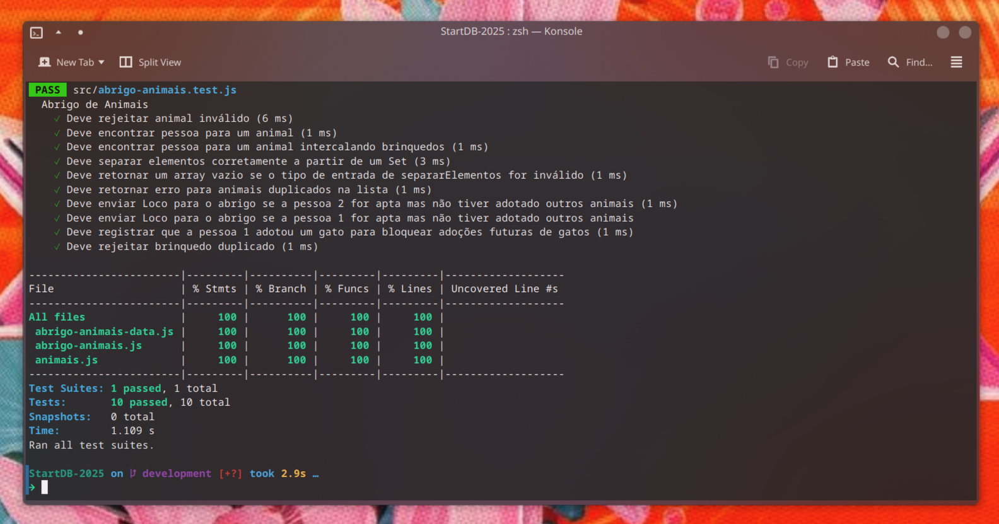

# Desafio Abrigo de Animais | Solução por Diogo Nogueira de Sousa


## 1. Visão Geral do Projeto

Este repositório contém a solução completa para o desafio técnico do processo seletivo da DB. O projeto implementa um sistema de gerenciamento de adoções para um abrigo de animais, aplicando um conjunto de regras de negócio específicas e garantindo a robustez da solução através de uma suíte de testes unitários completa.

## 2. Decisões Técnicas e Melhorias

Além de cumprir os requisitos funcionais, o código foi estruturado utilizando boas práticas de engenharia de software para garantir clareza, manutenibilidade e escalabilidade.

-   **Arquitetura Orientada a Objetos**: A entidade `Animal` foi abstraída em sua própria classe (`src/animal.js`), transformando um simples objeto de dados em uma estrutura mais semântica e reutilizável.
-   **Separação de Responsabilidades (SoC)**: A lógica de negócio (`AbrigoAnimais`), a definição da estrutura de dados (`Animal`) e a fonte de dados (`animais-data.js`) foram desacopladas em arquivos distintos. Essa separação torna o código mais fácil de entender e modificar. Por exemplo, para adicionar novos animais, basta editar o arquivo de dados, sem qualquer risco para a lógica da aplicação.
-   **Desenvolvimento Guiado por Testes (TDD)**: Utilizando o framework Jest, foi criada uma suíte de testes abrangente que valida todas as regras de negócio e casos de exceção. O desenvolvimento foi focado em garantir a cobertura de todas as linhas e branches de código, resultando em uma aplicação confiável e com comportamento previsível.

## 3. Regras de Negócio Implementadas

O sistema atende a todas as regras de negócio especificadas no desafio:

-   ✅ Adoção baseada na ordem correta de brinquedos favoritos.
-   ✅ Pessoas podem ter brinquedos a mais, desde que a ordem dos favoritos seja mantida.
-   ✅ Gatos não compartilham brinquedos (uma pessoa só pode adotar um gato).
-   ✅ Em caso de empate (ambas as pessoas aptas), o animal permanece no abrigo.
-   ✅ Limite de no máximo três animais por pessoa.
-   ✅ O jabuti "Loco" só pode ser adotado por alguém que já tenha outro animal.
-   ✅ Validação de entradas para rejeitar animais ou brinquedos duplicados/inválidos.

## 4. Estrutura de Arquivos

A solução foi organizada na seguinte estrutura de pastas e arquivos:

```

.
├── src/
│   ├── animal.js              \# Classe que modela a estrutura de um animal.
│   ├── animais-data.js        \# "Banco de dados" com a lista de animais.
│   ├── abrigo-animais.js      \# Classe principal com a lógica de adoção.
│   └── abrigo-animais.test.js \# Testes unitários com Jest.
├── .gitignore
├── jest.config.js
├── package.json
└── README.md

````

## 5. Como Executar

**Pré-requisitos:**
-   Node.js

**1. Clonar e Instalar as Dependências:**
No seu terminal, navegue até a pasta desejada e execute os comandos:

```bash
 # Clone o repositório
git clone https://github.com/DIOGO03-NS/desafio-DIOGO03-NS-2025.git

# Entre na pasta do projeto
cd desafio-DIOGO03-NS-2025

# Instale as dependências
npm install
```

**6. Executar os Testes:**
Para validar a funcionalidade e rodar a suíte de testes, utilize o comando:

```bash
npm test
```

Para gerar um relatório detalhado de cobertura de testes:

```bash
npm test -- --coverage
```

## 7. Cobertura de Testes

A suíte de testes foi desenvolvida com o objetivo de validar todos os fluxos e regras de negócio, alcançando uma alta cobertura de código e garantindo a confiabilidade da solução.


